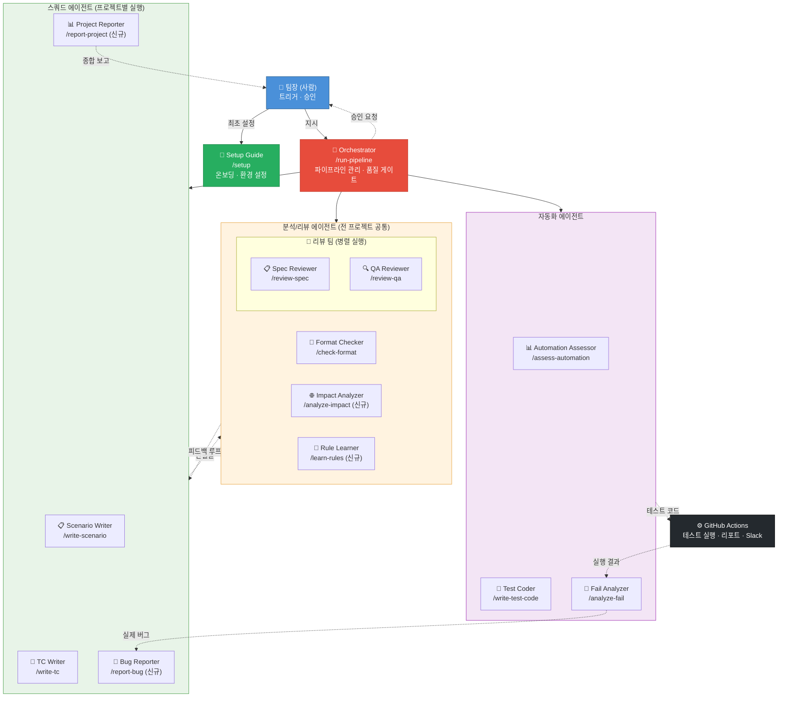

# QA AI 에이전트 아키텍처 v2.2

> 작성일: 2026-02-24 | 최종 수정: 2026-02-25
> 팀장 (사람) + Orchestrator 기반 자율 협업 AI 에이전트 팀

---

## 1. 개요

### 1.1 컨셉

```
v1 (이전):  팀장이 매 단계 트리거/확인 → 병목
v2 (현재):  팀장은 한 번만 지시 → 에이전트가 자율 협업 → 최종 결과 보고

팀장 (사람, 1명)
  │
  │ "새 업무 줄게" (최소 입력도 OK)
  │
  ▼
Orchestrator (AI)
  │
  │ 부족한 정보 자동 수집 (프로젝트, 버전, 기획서 링크 등)
  │ 프로젝트 config 참조 (config/projects/*.json)
  │ 파이프라인 생성 및 에이전트 자율 협업 관리
  │
  ▼
AI 에이전트 팀 (14개, 역할별 전문 에이전트)
  │
  │ 자율 협업: 작성 → 검토 → 수정 → 재검토 → 확정
  │
  ▼
산출물 + 팀장에게 최종 보고 (승인 필요 시점만)
```

### 1.2 핵심 원칙

| 원칙 | 설명 |
|------|------|
| **Orchestrator 중심** | 에이전트 간 소통은 Orchestrator가 중개. 에이전트끼리 직접 호출하지 않음 |
| **자율 협업** | 검토 → 수정 → 재검토 루프를 에이전트끼리 자동 반복 |
| **최소 개입** | 팀장은 승인 포인트에서만 개입 (7개 시점: 계획 확인 + 6개 승인) |
| **프로젝트 병렬** | SAY, BAY, SSO 파이프라인 동시 실행 |
| **리뷰 공통** | 분석/리뷰 에이전트는 스쿼드 구분 없이 동일 기준 적용 |
| **GH Actions 연동** | 리포트 생성/Slack 공유는 GitHub Actions 워크플로가 처리 |
| **프로젝트 config** | 프로젝트별 설정/상태를 `config/projects/*.json`으로 관리 |

### 1.3 프로젝트 컨텍스트 관리

Orchestrator가 프로젝트 정보를 자동으로 참조할 수 있도록 프로젝트별 설정 파일을 관리한다.

**파일 위치:** `config/projects/{project_name}.json`

```json
{
  "name": "SAY",
  "platform": "admin",
  "jira_project_key": "SAY",
  "confluence": {
    "space_key": "SAY",
    "parent_page_id": "123456"
  },
  "figma": {
    "file_id": "abc123"
  },
  "current_version": "v1.4.0",
  "features": {
    "ai_guide": {
      "version": "v1.4.0",
      "status": "tc_review",
      "confluence_page_id": "789012",
      "figma_node_id": "11680-28483",
      "scenarios": ["data/scenarios/say_admin_v1.4.0_ai_guide_scenario.md"],
      "tc": ["data/tc/say_admin_v1.4.0_ai_guide_tc.json"]
    },
    "dashboard": {
      "version": "v1.4.0",
      "status": "not_started",
      "confluence_page_id": null,
      "figma_node_id": null,
      "scenarios": [],
      "tc": []
    }
  }
}
```

**feature status 값:**

| status | Phase | 설명 |
|--------|-------|------|
| `not_started` | - | 미착수 |
| `scenario_writing` | 1-A | 시나리오 작성 중 |
| `scenario_review` | 1-A | 시나리오 리뷰 중 (Spec Reviewer + QA Reviewer 병렬) |
| `scenario_review_pass` | 1-A | 시나리오 리뷰 Pass (★ 승인 1 대기) |
| `figma_review` | 1-A | Figma 보강 + 팀장 검수 중 |
| `scenario_confirmed` | 1-A | 시나리오 확정 (★ 승인 2 완료) |
| `tc_writing` | 1-B | TC 작성 중 |
| `format_review` | 1-B | 양식 검토 중 (Format Checker) |
| `tc_review` | 1-B | TC 내용 리뷰 중 (Spec Reviewer + QA Reviewer 병렬) |
| `tc_confirmed` | 1-B | TC 확정 (★ 승인 3 완료) |
| `automation_review` | 3 | 자동화 검토 중 |
| `automation_coding` | 3 | 자동화 코드 작성 중 |
| `testing` | 3 | 테스트 실행 중 |
| `fail_analysis` | 3 | FAIL 분석 중 |
| `done` | 4 | 완료 |

Orchestrator는 파이프라인 진행 시 이 status를 자동 업데이트한다.

### 1.4 사람 조직 → AI 에이전트 매핑

| 사람 조직 (qa_organization.md) | AI 에이전트 | 비고 |
|------|------|------|
| 팀장 | 팀장 (사람 유지) | 트리거 + 승인만 |
| 스쿼드 리드 - 시나리오 작성 | Scenario Writer | |
| 스쿼드 리드 - 프로젝트 보고 | **Project Reporter** | 신규 |
| 스쿼드 팀원 - TC 작성 | TC Writer | |
| 스쿼드 팀원 - 버그 리포팅 | **Bug Reporter** | 신규 |
| 분석/리뷰 파트장 - 크로스 분석 | **Impact Analyzer** | 신규 |
| 분석/리뷰 파트장 - 표준 관리 | **Rule Learner** | 신규 |
| 양식 검토 담당 | Format Checker | |
| 내용 리뷰 담당 (기획서 기준) | Spec Reviewer | 신규 (Content Reviewer 분리) |
| 내용 리뷰 담당 (QA 관점) | QA Reviewer | 신규 (Content Reviewer 분리) |
| 자동화 파트장 - 사전 검토 | Automation Assessor | |
| 자동화 엔지니어 - 코드 작성 | Test Coder | |
| 자동화 엔지니어 - FAIL 분석 | Fail Analyzer | |
| QA 인프라 - 리포트/Slack | GitHub Actions | 에이전트 불필요 |
| — | **Orchestrator** | 신규 (팀장 조율 업무 대행) |
| — | **Setup Guide** | 신규 (온보딩/환경 설정) |

---

## 2. 에이전트 구조

### 2.1 전체 구조도 (14개)



### 2.2 프로젝트별 파이프라인 흐름

```
 ┌──────────────────────────────────────────────────┐
 │  Phase -1: 온보딩 (최초 1회)                       │
 │                                                    │
 │  [Setup Guide] /setup 실행                         │
 │       ├── 공통 설정 (config/common.json)            │
 │       ├── 프로젝트 설정 (config/projects/*.json)    │
 │       ├── API 키 (.env)                            │
 │       └── MCP 연결 확인                             │
 │                                                    │
 │  ⚠️ 자동 감지: 미설정 시 온보딩 안내               │
 └──────────────────────┬───────────────────────────┘
                        ▼
팀장: (자유 형식 입력)
         │
         ▼
    [Orchestrator] Phase 0: 입력 수집 + 계획 확인
         │
         ├── 팀장 입력 해석 (프로젝트, 작업 유형, 기능 등)
         ├── config/projects/*.json 참조
         ├── 부족한 정보 → 팀장에게 질문
         ├── 정보 확보 → 진행 계획 수립
         ├── ★ 팀장에게 계획 보고 → 확인 받기
         └── 팀장 확인 → config 업데이트 → 파이프라인 생성
         │
    ┌────┼────────────┐
    ▼    ▼            ▼
  SAY   BAY          SSO        ← 각 프로젝트 독립 파이프라인
    │    │            │
    ▼    ▼            ▼
 ┌──────────────────────────────────────────────────┐
 │  Phase 1-A: 시나리오 확정                           │
 │                                                    │
 │  ① [Scenario Writer] 기획서 기반 1차 시나리오 작성   │
 │       ↓                                            │
 │  ② [Spec Reviewer + QA Reviewer] 병렬 크로스 체크    │
 │       │  Spec: 기획서 대비 커버리지/정합성             │
 │       │  QA:   엣지케이스/실행 가능성/네거티브          │
 │       │                                            │
 │       ├── 피드백 → Scenario Writer 수정 → 재리뷰    │
 │       ▼ PASS                                       │
 │                                                    │
 │  ★ 승인 1: 1차 시나리오 리뷰 Pass 확인               │
 │                                                    │
 │  ③ (Figma 나옴) [Scenario Writer] Figma 보강        │
 │       │  + 불일치 리포트 생성                        │
 │       ↓                                            │
 │  ④ 팀장: Chrome + Claude in Chrome으로 Figma 검수   │
 │       │  (templates/figma_review_prompt.md 활용)     │
 │       ↓                                            │
 │  ★ 승인 2: Figma 검수 후 시나리오 확정               │
 └──────────────────────┬───────────────────────────┘
                        ▼
 ┌──────────────────────────────────────────────────┐
 │  Phase 1-B: TC 확정                                │
 │                                                    │
 │  ⑤ [TC Writer] TC 작성 (확정 시나리오 기반)          │
 │       ↓                                            │
 │  ⑥ [Format Checker] 양식 검토                       │
 │       │                                            │
 │       ├── FAIL → TC Writer 수정 → 재검토            │
 │       │          (Pass될 때까지 루프, 최대 3회)       │
 │       ▼ PASS                                       │
 │  ⑦ [Spec Reviewer + QA Reviewer] 병렬 크로스 체크    │
 │       │  Spec: 확정 시나리오 대비 TC 커버리지          │
 │       │  QA:   실행 가능성/개발팀 협조/엣지케이스       │
 │       │                                            │
 │       ├── 피드백 → TC Writer 보완 → 재리뷰           │
 │       ▼ PASS                                       │
 │  [Rule Learner] 리뷰 결과에서 위반 패턴 축적         │
 │                                                    │
 │  ★ 승인 3: TC 확정                                  │
 └──────────────────────┬───────────────────────────┘
                        ▼ (팀장 승인)
 ┌──────────────────────────────────────────────────┐
 │  Phase 3: 자동화                                   │
 │                                                    │
 │  [Automation Assessor] 사전 검토                    │
 │       ↓                                            │
 │  ★ 승인 4: 자동화 구현 여부 결정                     │
 │       ↓ (팀장 승인)                                 │
 │  [Test Coder] 테스트 코드 작성                      │
 │       ↓                                            │
 │  [GitHub Actions] 테스트 실행 + 리포트 + Slack       │
 │       ↓                                            │
 │  [Fail Analyzer] FAIL 건 분석                       │
 │       │                                            │
 │       ├── 코드 이슈 → Test Coder 자동 수정          │
 │       ├── 실제 버그 → [Bug Reporter] JIRA 생성      │
 │       └── 환경 이슈 → Flaky 마킹                   │
 │       ↓                                            │
 │  ★ 승인 5: FAIL 분석 결과 (실제 버그 시)             │
 └──────────────────────┬───────────────────────────┘
                        ▼
 ┌──────────────────────────────────────────────────┐
 │  Phase 4: 최종 보고                                │
 │                                                    │
 │  [Project Reporter] 프로젝트별 종합 현황 보고        │
 │       ↓                                            │
 │  팀장에게 최종 보고                                  │
 └──────────────────────────────────────────────────┘
```

### 2.3 크로스 프로젝트 운영 (SSO 등 공통 변경)

```
팀장: "SSO v3.0 변경됐어, 영향도 분석해"
         │
         ▼
    [Orchestrator]
         │
         ▼
    [Impact Analyzer] 크로스 프로젝트 영향도 분석
         │
         │  SSO v3.0 로그인 플로우 변경 분석 결과:
         │  ├── SAY: 로그인 시나리오 2건, TC 5건 수정 필요
         │  ├── BAY: SSO 연동 TC 3건 추가 필요
         │  └── SSO: 자체 시나리오 이미 반영됨
         │
         ▼
    ★ 승인 포인트 4: 영향도 확인
         │
         ▼ (팀장 승인)
    [Orchestrator] 영향받는 프로젝트별 수정 파이프라인 실행
         │
         ├── SAY 라인: Scenario Writer 수정 → TC Writer 수정 → 리뷰 루프
         └── BAY 라인: TC Writer 추가 → 리뷰 루프
```

### 2.4 품질 게이트 (Orchestrator 판단 기준)

| 게이트 | Phase | 통과 기준 | 미달 시 |
|--------|-------|-----------|---------|
| 시나리오 리뷰 | 1-A | Spec + QA 양쪽 Pass (높음 심각도 0건 + 커버리지 90%) | Scenario Writer에 보완 지시 → 재리뷰 |
| 양식 검토 | 1-B | 위반 0건 | TC Writer에 수정 지시 → 재검토 (최대 3회) |
| TC 리뷰 | 1-B | Spec + QA 양쪽 Pass (커버리지 90% + 실행 가능성 확인) | TC Writer에 보완 지시 → 재리뷰 |
| 자동화 검토 | 3 | 검토 리포트 완성 | 팀장 승인 대기 |
| FAIL 분석 | 3 | 분류 완료 | 코드 이슈는 자동 수정, 실제 버그는 팀장 보고 |
| 루프 한도 | 전체 | 재작업 3회 초과 시 | 팀장에게 에스컬레이션 |

---

## 3. 에이전트 상세 설계

### 3.0 Setup Guide (신규 - 온보딩)

| 항목 | 내용 |
|------|------|
| **이름** | Setup Guide |
| **스킬** | `/setup` (신규) |
| **성격** | 친절하고 단계적, 초보자도 따라갈 수 있는 가이드 |
| **트리거** | 팀장/팀원: `/setup` / 미설정 자동 감지 시 안내 |
| **입력** | 없음 (대화형으로 수집) |
| **출력** | `config/common.json`, `config/projects/*.json`, `.env` 업데이트 |

**온보딩 흐름:**

```
/setup 실행
  ├── Step 1: 공통 설정 (Confluence URL, JIRA URL, Slack 설정)
  ├── Step 2: API 키 (.env 파일 생성/업데이트)
  ├── Step 3: 프로젝트 설정 (SAY/BAY/SSO 정보 입력)
  └── Step 4: 연결 확인 (각 서비스 테스트)
```

**자동 감지 규칙:**

```
세션 시작 시:
  - config/common.json 필수 값 비어있음 → "⚠️ /setup 으로 초기 세팅을 먼저 진행해주세요."
  - .env 파일 없음 → "⚠️ .env 파일이 없습니다."
  - 온보딩 완료 상태 → 안내 없이 바로 업무 수행
```

**서브 커맨드:**

| 커맨드 | 동작 |
|--------|------|
| `/setup` | 전체 온보딩 (최초 1회) |
| `/setup check` | 현재 설정 상태 확인 |
| `/setup update {프로젝트}` | 특정 프로젝트 설정 변경 |

---

### 3.1 Orchestrator (신규)

| 항목 | 내용 |
|------|------|
| **이름** | Orchestrator |
| **스킬** | `/run-pipeline` (신규) |
| **성격** | 체계적이고 판단력 있는 조율자, 팀장 대행 |
| **트리거** | 팀장: 자유 형식 ("새 업무 줄게", "SAY 처리해", "TC 만들어줘" 등) |
| **입력** | 팀장의 자연어 지시 → 필요 정보 자동 수집 |
| **출력** | 파이프라인 실행 로그, 승인 요청, 최종 보고 |
| **도구** | 모든 에이전트 스킬 호출 권한, 파일 시스템, 프로젝트 config |

**역할 1: 입력 수집 (팀장 지시 해석)**

팀장이 어떤 형식으로 말해도 Orchestrator가 필요한 정보를 파악하고, 부족하면 질문한다.

```
필수 정보:
  ① 프로젝트명  (SAY / BAY / SSO)
  ② 작업 유형   (신규 기능 / 기존 수정 / 영향도 분석 / 현황 보고)
  ③ 버전        (v1.4.0 등)
  ④ 기능명      (AI 가이드, 대시보드 등)
  ⑤ 기획서 위치  (Confluence Page ID 또는 URL)
  ⑥ Figma 디자인 (Node ID, 있는 경우)
```

**입력 해석 흐름:**

```
팀장 입력 → Orchestrator 해석 → 부족한 정보 질문 → 진행 계획 보고 → 팀장 확인 → 파이프라인 시작

예시 1: 정보 충분
━━━━━━━━━━━━━━━
팀장: "SAY v1.5.0 대시보드 기능 추가됐어, 기획서: https://confluence.../pages/345678"
Orchestrator:
  ✅ 프로젝트: SAY
  ✅ 작업 유형: 신규 기능
  ✅ 버전: v1.5.0
  ✅ 기능명: 대시보드
  ✅ 기획서: 345678
  → 진행 계획 보고:
    "SAY v1.5.0 대시보드 신규 기능입니다.
     1) 기획서 분석 → 시나리오 작성
     2) TC 작성
     3) 양식 검토 → 내용 리뷰 (자동 루프)
     4) 산출물 확정 (팀장 승인)
     진행할까요?"
  → 팀장: "응"
  → 파이프라인 시작

예시 2: 프로젝트만 있음
━━━━━━━━━━━━━━━━━━━
팀장: "SAY 신규 기능 추가됐어"
Orchestrator:
  ✅ 프로젝트: SAY
  ✅ 작업 유형: 신규 기능
  ❓ "어떤 기능인가요? (기능명)"
  ❓ "버전은 무엇인가요? (현재 config: v1.4.0)"
  ❓ "기획서 Confluence 링크를 공유해주세요"

예시 3: 최소 입력
━━━━━━━━━━━━━━━
팀장: "새 업무 줄게"
Orchestrator:
  ❓ "어떤 프로젝트인가요? (SAY / BAY / SSO)"
  ❓ "어떤 작업인가요? (신규 기능 추가 / 기존 기능 수정 / 영향도 분석 / 현황 보고)"

예시 4: 기존 config 활용
━━━━━━━━━━━━━━━━━━━━━━
팀장: "SAY 대시보드 기획서 나왔어, https://confluence.../pages/345678"
Orchestrator:
  ✅ 프로젝트: SAY (config/projects/say.json 참조)
  ✅ 기능명: 대시보드 (config에 이미 등록됨, status: not_started)
  ✅ 기획서: 345678
  → 진행 계획 보고:
    "SAY v1.4.0 대시보드 기능입니다.
     config에 등록된 미착수 기능입니다.
     기획서 분석 → 시나리오 → TC → 리뷰 순으로 진행합니다.
     진행할까요?"
  → 팀장: "응"
  → config 업데이트 + 파이프라인 시작

예시 5: 부분 작업
━━━━━━━━━━━━━━━
팀장: "SAY AI 가이드 TC 리뷰해줘"
Orchestrator:
  ✅ 프로젝트: SAY
  ✅ 기능: AI 가이드 (config에서 tc 파일 경로 확인)
  ✅ 작업: TC 리뷰 (Phase 2만 실행)
  → Format Checker + Spec Reviewer + QA Reviewer 호출
```

**역할 2: 파이프라인 관리**

```
- 프로젝트별 파이프라인 생성/실행
- 단계별 순서 제어 (Phase 1 → 2 → 3 → 4)
- 병렬 프로젝트 동시 관리
- 진행 상태를 config/projects/*.json에 자동 업데이트
```

**역할 3: 에이전트 간 핸드오프**

```
- Scenario Writer 완료 → TC Writer에 산출물 전달
- Format Checker 피드백 → 해당 작성 에이전트에 수정 지시
- Fail Analyzer 결과 → Bug Reporter에 버그 전달
```

**역할 4: 품질 게이트 판단**

```
- 각 단계 통과 기준 확인
- 미달 시 자동 재작업 루프 (최대 3회)
- 루프 한도 초과 시 팀장 에스컬레이션
```

**역할 5: 팀장 커뮤니케이션**

```
- 부족한 정보 질문 (자연어)
- 승인 필요 시점에만 보고
- 최종 결과 종합 보고
```

**역할 6: 승인 알림 (Slack Bot DM)**

승인 포인트 도달 시 Slack Bot을 통해 팀장에게 DM으로 알림을 발송한다.

```
설정:
  - Slack App: QA_Agent Bot (신규 생성)
  - Bot Token Scopes: chat:write, im:write
  - 팀장 Slack User ID: config/slack.json에 저장
  - Bot Token: .env (SLACK_BOT_TOKEN)

발송 방식:
  Orchestrator → Slack API (chat.postMessage) → 팀장 DM
```

**승인 알림 메시지 템플릿:**

```
━━━━━━━━━━━━━━━━━━━━━━━━
🔔 QA Agent 승인 요청
━━━━━━━━━━━━━━━━━━━━━━━━
프로젝트: {프로젝트명} {버전} - {기능명}
단계: ★ 승인 {N}: {승인 포인트명}
상태: {상태 요약}

📋 산출물:
- {산출물 경로/링크}

📊 품질 요약:
- {커버리지/위반 건수 등}

⏳ 팀장 액션: {필요한 액션}
━━━━━━━━━━━━━━━━━━━━━━━━
```

**승인 포인트별 알림:**

| 승인 | 알림 내용 | 팀장 액션 |
|------|-----------|-----------|
| ★ 0 | 진행 계획 보고 | 계획 확인 → 실행 승인 |
| ★ 1 | 시나리오 리뷰 Pass | 리뷰 결과 확인 |
| ★ 2 | Figma 보강 완료 | Chrome + Claude in Chrome으로 검수 |
| ★ 3 | TC 리뷰 Pass | TC 확정 승인 |
| ★ 4 | 자동화 검토 리포트 | 자동화 구현 여부 결정 |
| ★ 5 | FAIL 분석 결과 (실제 버그) | 버그 리포트 확인 |
| ★ 6 | 크로스 프로젝트 영향도 | 영향 범위 확인 + 수정 승인 |

---

### 3.2 Scenario Writer (시나리오 작성)

| 항목 | 내용 |
|------|------|
| **이름** | Scenario Writer |
| **스킬** | `/write-scenario` (기존) |
| **성격** | 꼼꼼하고 구조적, 기획서를 빠짐없이 분석 |
| **트리거** | Orchestrator 또는 팀장 직접 지시 |
| **입력** | Confluence Page ID / Figma Node ID / 기획서 텍스트 |
| **출력** | `data/scenarios/{product}_{version}_{feature}_scenario.md` |
| **출력 (Figma 보강 시)** | 위 시나리오 + `data/reviews/figma_discrepancy_{version}_{feature}.json` |
| **도구** | Confluence MCP (읽기), Figma MCP (읽기) |

**Figma 보강 모드:**

| 단계 | 수행 내용 |
|------|-----------|
| 1. 디자인 확인 | Figma 화면 구성, UI 요소, 디스크립션 확인 |
| 2. 시나리오 보강 | 실제 문구, UI 상태(Default/Active/Disabled 등), 인터랙션 반영 |
| 3. 불일치 검출 | 기획서/정책서와 Figma 간 상이한 부분 식별 |
| 4. 반영 규칙 | **불일치 시 Figma 값을 우선 적용** → 시나리오에 반영 |
| 5. 불일치 보고 | Orchestrator에 보고 → 팀장 승인 포인트 |

**데이터 소스 우선순위:**

```
기본 모드:     1. Confluence (기획서) → 2. Figma (참고) → 3. 로컬 JSON
Figma 보강:    1. Figma (최우선) → 2. 기획서 (정책/로직) → 3. 로컬 JSON
```

---

### 3.3 TC Writer (TC 작성)

| 항목 | 내용 |
|------|------|
| **이름** | TC Writer |
| **스킬** | `/write-tc` (기존) |
| **성격** | 빈틈없고 체계적, 경계값과 에러 케이스에 강함 |
| **트리거** | Orchestrator (시나리오 완료 후) |
| **입력** | 시나리오 MD 파일 |
| **출력** | `data/tc/{product}_{version}_{feature}_tc.json` |
| **도구** | Google Sheets MCP, Confluence MCP (읽기) |
| **규칙** | Depth 구조, Expected Result 형식, 용어 규칙 등 |

---

### 3.4 Project Reporter (신규)

| 항목 | 내용 |
|------|------|
| **이름** | Project Reporter |
| **스킬** | `/report-project` (신규) |
| **성격** | 종합적이고 명확, 핵심만 요약 |
| **트리거** | Orchestrator (파이프라인 완료 후) / 팀장: "SAY 현황 보고해" |
| **입력** | 프로젝트명 (예: SAY, BAY, SSO) |
| **출력** | 프로젝트별 종합 현황 리포트 |
| **데이터 소스** | `data/scenarios/`, `data/tc/`, `data/reviews/`, `data/assessments/`, `data/fail_analysis/`, `data/test_results/` |

**출력 형식:**

```markdown
## SAY v1.4.0 현황 보고

### 산출물 현황
- 시나리오: 3건 완료 (AI 가이드, 상담, 대시보드)
- TC: 127건 완료 (AI 가이드 87건, 상담 45건, 대시보드 미착수)

### 품질 검증
- 양식 검토: 전건 Pass (1차 위반 2건 → 수정 후 Pass)
- 내용 리뷰: 커버리지 97% (누락 3건 보완 완료)

### 자동화
- 자동화 검토: 38/45건 권장 (팀장 승인 대기)
- 테스트 실행: 미진행

### 이슈/리스크
- Figma 불일치 2건 (기획자 동기화 필요)
- 대시보드 기획서 미확정 (시나리오 착수 불가)
```

---

### 3.5 Bug Reporter (신규)

| 항목 | 내용 |
|------|------|
| **이름** | Bug Reporter |
| **스킬** | `/report-bug` (신규) |
| **성격** | 정확하고 재현 가능한 버그 리포트 작성 |
| **트리거** | Orchestrator (Fail Analyzer가 실제 버그로 분류한 건) |
| **입력** | Fail Analyzer 분석 결과 JSON |
| **출력** | JIRA 티켓 생성 + `data/bugs/{product}_{version}_bugs.json` |
| **도구** | JIRA REST API |

**JIRA 티켓 형식:**

```json
{
  "project": "SAY",
  "issue_type": "Bug",
  "summary": "[자동화] AI 가이드 토글 상태 저장 후 미반영",
  "description": "## 재현 환경\nSTG-1.4.0\n\n## 재현 절차\n1. AI 가이드 상세 → 활성화 토글 ON\n2. 저장 클릭\n3. 목록 복귀 후 상세 재진입\n\n## 기대 결과\n토글 ON 상태 유지\n\n## 실제 결과\n토글 OFF로 초기화\n\n## 증거\n스크린샷: [첨부]\n자동화 로그: test_ai_guide_toggle line 45",
  "priority": "High",
  "labels": ["automation-detected"]
}
```

---

### 3.6 Format Checker (양식 검토)

| 항목 | 내용 |
|------|------|
| **이름** | Format Checker |
| **스킬** | `/check-format` (신규 개발) |
| **성격** | 엄격하고 규칙 기반, 양식 위반을 절대 놓치지 않음 |
| **트리거** | Orchestrator (TC/시나리오 작성 완료 후) |
| **입력** | 시나리오 MD 또는 TC JSON 파일 |
| **출력** | `data/reviews/format_check_{version}_{feature}.json` |
| **판정** | Pass / Fail (위반 건수 + 심각도) |

**검토 체크리스트:**

| # | 검토 항목 | 대상 | 자동 검출 |
|---|-----------|------|-----------|
| 1 | Depth 구조 규칙 (조건 하위 배치) | TC | 부분 가능 |
| 2 | Expected Result 형식 (결과만, 조건 금지) | TC | 패턴 매칭 |
| 3 | "노출됨" 중복 사용 | TC | 자동 |
| 4 | Priority 값 (P1/P2/P3만) | TC | 자동 |
| 5 | 금지 용어 ("테이블", "컬럼" 등) | TC/시나리오 | 자동 |
| 6 | 토스트/Alert 형식 준수 | TC | 패턴 매칭 |
| 7 | 문서 구조 (헤딩 레벨) | 시나리오 | 자동 |
| 8 | 중복 Depth 병합 패턴 | TC | 자동 |

---

### 3.7 리뷰 팀: Spec Reviewer + QA Reviewer (병렬 크로스 체크)

> 기존 Content Reviewer를 **두 명의 리뷰어**로 분리.
> 서로 다른 관점에서 동시에 리뷰하여 크로스 체크 효과를 극대화한다.

```
Orchestrator → [Spec Reviewer + QA Reviewer] 병렬 호출
                    │                    │
                    ▼                    ▼
             기획서 기준 리뷰      QA 관점 리뷰
             (빠진 거 없나?)     (놓치면 안 되는 건?)
                    │                    │
                    └───── 결과 병합 ─────┘
                              │
                    Orchestrator가 Pass/Fail 판정
```

#### 3.7.1 Spec Reviewer (기획서 기준 리뷰)

| 항목 | 내용 |
|------|------|
| **이름** | Spec Reviewer |
| **스킬** | `/review-spec` |
| **관점** | "기획서에 있는 걸 다 했나?" |
| **성격** | 꼼꼼하고 체계적, 기획서와 1:1 대조 |
| **트리거** | **Phase 1-A**: 시나리오 작성 후 / **Phase 1-B**: Format Checker Pass 후 |
| **입력** | (시나리오) 시나리오 MD + 기획서 / (TC) TC JSON + 시나리오 MD + 기획서 |
| **출력** | `data/reviews/spec_review_{version}_{feature}.json` |
| **판정** | Pass / 피드백 있음 (누락 건수 + 미반영 항목) |

**Phase 1-A 시나리오 리뷰 체크리스트:**

| # | 검토 항목 | 필수 확인 |
|---|-----------|-----------|
| 1 | 기획서 기능 커버리지 | 모든 기능이 시나리오에 포함되었는지 |
| 2 | 조건-결과 정합성 | 기획서와 시나리오의 조건-결과가 일치하는지 |
| 3 | 상태 흐름 오류 | 도달 불가능 상태, 순환 참조 |
| 4 | 섹션 간 불일치 | 같은 기능의 중복/모순 정의 |
| 5 | 용어 일관성 | 기획서 용어와 시나리오 용어 일치 |

**Phase 1-B TC 리뷰 체크리스트:**

| # | 검토 항목 | 필수 확인 |
|---|-----------|-----------|
| 1 | 시나리오-TC 매핑 | 확정 시나리오의 모든 항목이 TC로 전환되었는지 |
| 2 | 조건 정확성 | TC 전제조건/입력값이 기획서와 일치하는지 |
| 3 | 결과 정확성 | Expected Result가 기획서 명세와 일치하는지 |
| 4 | 토스트/Alert 문구 | 기획서 원문과 일치 |
| 5 | 화면 전환 | 이동 대상 명시, 기획서와 일치 |
| 6 | 기획서 보조 크로스체크 | 시나리오에서 누락되어 TC에도 빠진 항목 |

#### 3.7.2 QA Reviewer (QA 관점 크로스 체크)

| 항목 | 내용 |
|------|------|
| **이름** | QA Reviewer |
| **스킬** | `/review-qa` |
| **관점** | "기획서에 없지만 놓치면 안 되는 건?" |
| **성격** | 실전 경험 기반, 엣지케이스와 리스크 감지 |
| **트리거** | Spec Reviewer와 동시 (병렬 실행) |
| **입력** | Spec Reviewer와 동일 |
| **출력** | `data/reviews/qa_review_{version}_{feature}.json` |
| **판정** | Pass / 추가 제안 (엣지케이스 + 실행 가능성 분석) |

**Phase 1-A 시나리오 리뷰 체크리스트:**

| # | 검토 항목 | 필수 확인 |
|---|-----------|-----------|
| 1 | 경계 조건 누락 | 0건, 최대값, 빈 값, 특수문자 처리 |
| 2 | 네거티브 시나리오 | 실패/에러/예외 상황 커버리지 |
| 3 | 사용자 실수 시나리오 | 잘못된 입력, 중복 클릭, 브라우저 뒤로가기 |
| 4 | 상태 간 전환 | 비정상 전환, 동시 조작, 새로고침 |
| 5 | 권한/역할별 분기 | 관리자/일반/미인증 사용자별 동작 차이 |

**Phase 1-B TC 리뷰 체크리스트:**

| # | 검토 항목 | 필수 확인 |
|---|-----------|-----------|
| 1 | 입력 필드 경계값 | 정상, 최대, 초과, 빈 값, 형식 오류 |
| 2 | 버튼 비활성화 | 비활성화 조건, 활성화 조건, 클릭 동작 |
| 3 | 성공/실패 쌍 | 모든 동작에 양쪽 케이스 |
| 4 | 에러 케이스 | 네트워크 오류, 중복 데이터, 시간 초과 |
| 5 | 권한별 동작 | 권한 있음/없음, URL 직접 접근 |

**Phase 1-B 실행 가능성 분석 (Feasibility):**

| # | 판단 항목 | 분류 | 예시 |
|---|-----------|------|------|
| 1 | QA 독자 실행 가능 | ✅ 실행 가능 | 일반 UI 조작, 입력값 검증 |
| 2 | 개발팀 세팅 필요 | ⚠️ 협조 필요 | 테스트 데이터 생성, PG 테스트 모드, mock API |
| 3 | 테스트 기간 내 불가 | 🔶 일정 조율 | 부하 테스트, 장기 모니터링, 외부 연동 |
| 4 | 직접 재현 불가 | 🔴 대안 필요 | 서버 500 에러, 타임아웃, 인프라 장애 시나리오 |

**실행 가능성 분석 출력 예시:**

```json
{
  "feasibility_summary": {
    "executable": 45,
    "dev_support_needed": 3,
    "schedule_adjustment": 2,
    "alternative_needed": 1
  },
  "details": [
    {
      "tc_id": "TC-025",
      "category": "dev_support_needed",
      "reason": "결제 실패 케이스 - PG 테스트 모드 세팅 필요",
      "action": "개발팀에 PG 테스트 모드 활성화 요청"
    },
    {
      "tc_id": "TC-041",
      "category": "alternative_needed",
      "reason": "서버 500 에러 응답 시 화면 처리 - 직접 재현 불가",
      "action": "개발팀에 mock API 요청 또는 프록시 활용"
    }
  ]
}
```

---

### 3.8 Impact Analyzer (신규)

| 항목 | 내용 |
|------|------|
| **이름** | Impact Analyzer |
| **스킬** | `/analyze-impact` (신규) |
| **성격** | 논리적이고 광범위한 시야, 연쇄 영향을 추적 |
| **트리거** | 팀장: "SSO 변경 영향도 분석해" / Orchestrator |
| **입력** | 변경된 모듈/기능 설명 + 변경 범위 |
| **출력** | `data/reviews/impact_{module}_{version}.json` |
| **데이터 소스** | 전 프로젝트의 `data/scenarios/`, `data/tc/` |

**분석 항목:**

| 항목 | 설명 |
|------|------|
| 영향 프로젝트 식별 | 변경 모듈을 참조하는 시나리오/TC 검색 |
| 영향 범위 산정 | 프로젝트별 수정 필요 시나리오/TC 건수 |
| 수정 가이드 | 프로젝트별 구체적 수정 방향 제시 |
| 리그레션 범위 | 재테스트 필요 범위 식별 |

**출력 형식:**

```json
{
  "changed_module": "SSO v3.0",
  "change_description": "로그인 플로우 변경: 2FA 추가",
  "impact": [
    {
      "project": "SAY",
      "affected_scenarios": ["say_admin_v1.4.0_login_scenario.md"],
      "affected_tc_count": 5,
      "action": "로그인 시나리오 2FA 단계 추가, TC 5건 수정"
    },
    {
      "project": "BAY",
      "affected_scenarios": ["bay_v2.1.0_auth_scenario.md"],
      "affected_tc_count": 3,
      "action": "SSO 연동 TC 3건 추가"
    },
    {
      "project": "SSO",
      "affected_scenarios": [],
      "affected_tc_count": 0,
      "action": "자체 시나리오에 이미 반영"
    }
  ],
  "regression_scope": "로그인/인증 관련 전체 테스트 재실행 권장"
}
```

---

### 3.9 Rule Learner (신규)

| 항목 | 내용 |
|------|------|
| **이름** | Rule Learner |
| **스킬** | `/learn-rules` (신규) |
| **성격** | 패턴 인식에 강하고, 점진적 개선 지향 |
| **트리거** | Orchestrator (리뷰 완료 후 자동) |
| **입력** | Format Checker / Spec Reviewer / QA Reviewer 리뷰 결과들 |
| **출력** | `data/rules/violation_patterns.json`, 규칙 개선 제안 |

**핵심 역할:**

```
1. 반복 위반 패턴 축적
   - 동일 위반이 2회 이상 → 패턴으로 등록
   - 프로젝트별/에이전트별 위반 빈도 추적

2. 규칙 강화 제안
   - 패턴화된 위반 → Format Checker 체크리스트 추가 제안
   - 팀장 승인 후 반영

3. 학습 데이터
   - data/rules/violation_patterns.json: 위반 패턴 DB
   - data/rules/rule_changelog.json: 규칙 변경 이력
```

---

### 3.10 Automation Assessor (자동화 사전 검토)

| 항목 | 내용 |
|------|------|
| **이름** | Automation Assessor |
| **스킬** | `/assess-automation` (신규 개발) |
| **성격** | 현실적이고 실용적, 기술적 판단에 강함 |
| **트리거** | Orchestrator (산출물 확정 후) |
| **입력** | TC JSON + 기존 테스트 코드 (tests/) |
| **출력** | `data/assessments/automation_assessment_{version}_{feature}.json` |
| **판정** | 권장/조건부/비권장 (팀장이 최종 결정) |

**검토 항목:**

| 항목 | 분석 내용 |
|------|-----------|
| 자동화 적합성 | UI 의존도, 데이터 의존도, 재현 안정성 |
| 기술적 제약 | 외부 시스템 연동, 인증, 캡차, 파일 업로드 |
| 기존 코드 영향 | fixture/helper 수정 필요 여부 |
| 공수 산정 | TC당 예상 구현 시간, 총 소요 기간 |

---

### 3.11 Test Coder (테스트 코드 작성)

| 항목 | 내용 |
|------|------|
| **이름** | Test Coder |
| **스킬** | `/write-test-code` (기존) |
| **성격** | 정확하고 효율적, 안정적인 코드를 작성 |
| **트리거** | Orchestrator (팀장 자동화 승인 후) |
| **입력** | TC JSON / 시나리오 MD |
| **출력** | `tests/test_{platform}_{feature}.py` |
| **도구** | 파일 시스템, Playwright, pytest |
| **규칙** | AAA 패턴, data-testid 우선, 명시적 대기 |

**실행은 GitHub Actions가 담당:**

```
Test Coder: 코드 작성 → Git push
     ↓
GitHub Actions: pytest 실행 → 리포트 생성 → Confluence 업로드 → Slack 공유
     ↓
Fail Analyzer: GH Actions 결과 분석
```

---

### 3.12 Fail Analyzer (FAIL 분석)

| 항목 | 내용 |
|------|------|
| **이름** | Fail Analyzer |
| **스킬** | `/analyze-fail` (신규 개발) |
| **성격** | 논리적이고 침착, 원인 추적에 강함 |
| **트리거** | Orchestrator (GitHub Actions 실행 결과 수신 후) |
| **입력** | GitHub Actions 테스트 결과 + 테스트 코드 + 스크린샷 |
| **출력** | `data/fail_analysis/fail_analysis_{version}_{date}.json` |

**분류 기준:**

| 분류 | 설명 | 후속 처리 |
|------|------|-----------|
| 코드 이슈 | 셀렉터 변경, 타이밍 문제 | → Test Coder 자동 수정 |
| 실제 버그 | 기능이 기대와 다르게 동작 | → Bug Reporter → JIRA 생성 |
| 환경 이슈 | 서버 불안정, 네트워크 | → Flaky 마킹, 재실행 |
| TC 오류 | TC 자체가 잘못됨 | → TC Writer 수정 |

---

## 4. 에이전트 교체/커스터마이징

### 4.1 교체 방법

```
.claude/skills/{skill-name}/SKILL.md 수정으로 즉시 변경 가능

├── 성격/스타일 변경 → "엄격하게" ↔ "유연하게"
├── 검토 기준 변경 → 체크리스트 항목 추가/제거
├── 출력 형식 변경 → JSON ↔ 마크다운
└── 도구 변경 → MCP 연결 추가/제거
```

### 4.2 스타일 프리셋

| 스타일 | 적합한 에이전트 |
|--------|----------------|
| **엄격(Strict)** | Format Checker |
| **분석적(Analytical)** | Spec Reviewer, QA Reviewer, Automation Assessor, Impact Analyzer |
| **효율적(Efficient)** | TC Writer, Test Coder |
| **보수적(Conservative)** | Scenario Writer |
| **종합적(Holistic)** | Orchestrator, Project Reporter |
| **탐구적(Explorative)** | Rule Learner, Fail Analyzer |

### 4.3 에이전트별 조정 항목

| 에이전트 | 조정 가능 항목 |
|----------|---------------|
| Orchestrator | 재작업 루프 한도 (기본 3회), 승인 포인트 추가/제거 |
| Format Checker | 검토 엄격도 (경고만 vs 반려) |
| Spec Reviewer | 커버리지 기준 (90% vs 95%) |
| QA Reviewer | 실행 가능성 판단 기준 (협조 필요 범위) |
| Automation Assessor | 공수 산정 기준 |
| Fail Analyzer | 자동 수정 범위 (셀렉터만 vs 로직까지) |
| Rule Learner | 패턴 등록 기준 (2회 반복 vs 3회) |

---

## 5. 팀장 인터페이스

### 5.1 명령어 체계

**온보딩 명령:**

| 명령 | 동작 |
|------|------|
| `/setup` | 환경 설정 온보딩 (최초 1회) |
| `/setup check` | 설정 상태 확인 |
| `/setup update SAY` | SAY 프로젝트 설정 변경 |

**파이프라인 명령 (Orchestrator 경유):**

| 명령 | 동작 |
|------|------|
| "SAY v1.4.0 처리해" | 전체 파이프라인 실행 (시나리오 → TC → 리뷰 → 보고) |
| "SAY, BAY, SSO 전부 처리해" | 3개 프로젝트 병렬 파이프라인 |
| "SAY TC부터 리뷰까지" | 부분 파이프라인 (TC 작성 → 리뷰) |
| "SSO 영향도 분석해" | Impact Analyzer 실행 |
| "프로젝트별 현황 보고해" | Project Reporter 전체 실행 |

**개별 에이전트 직접 명령 (Orchestrator 없이):**

| 명령 | 에이전트 |
|------|----------|
| "시나리오 작성해줘" | Scenario Writer |
| "TC 만들어줘" | TC Writer |
| "양식 검토해줘" | Format Checker |
| "내용 리뷰해줘" | Spec Reviewer + QA Reviewer (병렬) |
| "자동화 검토해줘" | Automation Assessor |
| "FAIL 분석해줘" | Fail Analyzer |

### 5.2 승인 포인트 (7개)

```
팀장 입력 (자유 형식)
     ▼
[Orchestrator] 정보 수집 + 계획 수립
     ▼
★ 승인 0: 진행 계획 확인 (팀장 확인 후 실행)
     ▼
[자율 진행] 시나리오 작성
[자율 진행] 시나리오 리뷰 ↔ 수정 루프
     ▼
★ 승인 1: 1차 시나리오 리뷰 Pass 확인
     ▼
[자율 진행] Figma 보강 + 불일치 리포트
[팀장 직접] Chrome + Claude in Chrome으로 Figma 검수
     ▼
★ 승인 2: Figma 검수 후 시나리오 확정
     ▼
[자율 진행] TC 작성
[자율 진행] 양식 검토 ↔ 수정 루프
[자율 진행] TC 리뷰 ↔ 보완 루프
     ▼
★ 승인 3: TC 확정
     ▼
[자율 진행] 자동화 사전 검토
     ▼
★ 승인 4: 자동화 구현 여부 결정
     ▼
[자율 진행] 테스트 코드 → GH Actions → FAIL 분석
     ▼
★ 승인 5: FAIL 분석 결과 (실제 버그 발견 시)
     ▼
★ 승인 6: 크로스 프로젝트 영향도 (해당 시)
```

---

## 6. 파일 구조

### 6.1 프로젝트 설정

```
config/
└── projects/                        ← Orchestrator가 참조/업데이트
    ├── say.json                       SAY 프로젝트 설정 + 기능별 상태
    ├── bay.json                       BAY 프로젝트 설정 + 기능별 상태
    └── sso.json                       SSO 프로젝트 설정 + 기능별 상태
```

### 6.2 에이전트 스킬 파일

```
.claude/skills/
├── setup/SKILL.md               (신규) Setup Guide - 온보딩
├── run-pipeline/SKILL.md         (신규) Orchestrator
├── write-scenario/SKILL.md       (기존) Scenario Writer
├── write-tc/SKILL.md             (기존) TC Writer
├── report-project/SKILL.md       (신규) Project Reporter
├── report-bug/SKILL.md           (신규) Bug Reporter
├── check-format/SKILL.md         (신규) Format Checker
├── review-spec/SKILL.md          (신규) Spec Reviewer
├── review-qa/SKILL.md            (신규) QA Reviewer
├── analyze-impact/SKILL.md       (신규) Impact Analyzer
├── learn-rules/SKILL.md          (신규) Rule Learner
├── assess-automation/SKILL.md    (신규) Automation Assessor
├── write-test-code/SKILL.md      (기존) Test Coder
└── analyze-fail/SKILL.md         (신규) Fail Analyzer
```

### 6.3 데이터 흐름

```
data/
├── scenarios/                      ← Scenario Writer
│   ├── say_admin_v1.4.0_*_scenario.md
│   ├── bay_v2.1.0_*_scenario.md
│   └── sso_v3.0_*_scenario.md
├── tc/                             ← TC Writer
│   ├── say_admin_v1.4.0_*_tc.json
│   ├── bay_v2.1.0_*_tc.json
│   └── sso_v3.0_*_tc.json
├── reviews/                        ← Format Checker + Spec Reviewer + QA Reviewer + Impact Analyzer
│   ├── format_check_*.json             ← Format Checker
│   ├── spec_review_*.json              ← Spec Reviewer
│   ├── qa_review_*.json                ← QA Reviewer
│   ├── figma_discrepancy_*.json        ← Scenario Writer (Figma 보강 시)
│   └── impact_*.json                   ← Impact Analyzer
├── assessments/                    ← Automation Assessor
│   └── automation_assessment_*.json
├── fail_analysis/                  ← Fail Analyzer
│   └── fail_analysis_*.json
├── bugs/                           ← Bug Reporter (신규)
│   └── {product}_{version}_bugs.json
├── rules/                          ← Rule Learner (신규)
│   ├── violation_patterns.json
│   └── rule_changelog.json
├── test_results/                   ← GitHub Actions (외부)
│   ├── test_results.json
│   └── checklist_results.json
└── pipeline/                       ← Orchestrator (신규)
    └── pipeline_status_{date}.json

tests/                              ← Test Coder
├── test_*.py
└── conftest.py
```

---

## 7. 개발 로드맵

### Phase 0: 온보딩 (즉시)

| 에이전트 | 상태 | 작업 |
|----------|------|------|
| Setup Guide | 🔧 개발 중 | 대화형 환경 설정 가이드, 자동 감지 규칙 |

### Phase 1: 기반 (즉시)

| 에이전트 | 상태 | 작업 |
|----------|------|------|
| Scenario Writer | ✅ 사용 가능 | SAY 프로젝트에서 이관 |
| TC Writer | ✅ 사용 가능 | SAY 프로젝트에서 이관 |
| Test Coder | ✅ 사용 가능 | SAY 프로젝트에서 이관 |

### Phase 2: 핵심 (우선)

| 에이전트 | 작업 | 우선순위 |
|----------|------|----------|
| **Orchestrator** | SKILL.md 신규, 파이프라인 엔진 | **최우선** |
| Format Checker | SKILL.md 신규, 양식 규칙 체크리스트 | 1순위 |
| Spec Reviewer | SKILL.md 신규, 기획서 기준 커버리지 분석 | 2순위 |
| QA Reviewer | SKILL.md 신규, QA 관점 크로스 체크 + 실행 가능성 | 2순위 |

### Phase 3: 확장

| 에이전트 | 작업 | 우선순위 |
|----------|------|----------|
| Fail Analyzer | SKILL.md 신규, 분류 로직 | 3순위 |
| Automation Assessor | SKILL.md 신규, 적합성 판단 기준 | 4순위 |
| Project Reporter | SKILL.md 신규, 데이터 집계 로직 | 5순위 |

### Phase 4: 고도화

| 에이전트 | 작업 | 우선순위 |
|----------|------|----------|
| Impact Analyzer | SKILL.md 신규, 크로스 프로젝트 분석 | 6순위 |
| Bug Reporter | SKILL.md 신규, JIRA API 연동 | 7순위 |
| Rule Learner | SKILL.md 신규, 패턴 학습 로직 | 8순위 |

### 필요 인프라

| 항목 | 현재 상태 | 필요 작업 |
|------|-----------|-----------|
| Google Sheets MCP | 설정 완료 | - |
| Atlassian MCP | 미설정 | Confluence 읽기/쓰기 연동 |
| JIRA API | 미설정 | .env에 JIRA 인증 정보 추가 |
| GitHub Actions | 운영 중 | 테스트 결과 JSON 출력 형식 표준화 |
| Figma MCP | 설정 완료 | 노드 ID 기반 요청만 사용 |
| **Slack Bot (QA_Agent)** | **미설정** | **Slack App 생성, Bot Token, 팀장 User ID 설정** |

---

## 8. 참고 문서

| 문서 | 설명 |
|------|------|
| [qa_organization.md](qa_organization.md) | 사람 조직 구조 (AI 에이전트 매핑 원본) |
| CLAUDE.md | 프로젝트 규칙, TC 작성 규칙 |
| 각 SKILL.md | 에이전트별 상세 프롬프트/규칙 |
