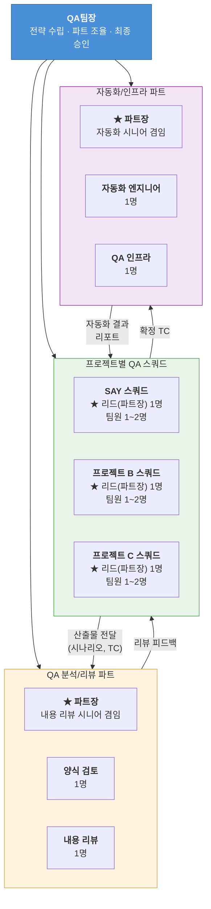
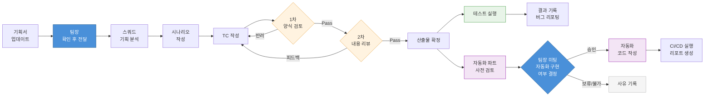
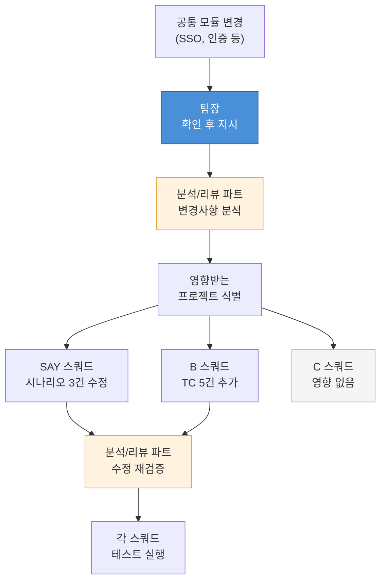

# QA 조직도

> 작성일: 2026-02-24
> 작성자: QA팀장

---

## 0. 조직도 시각화

### 전체 조직 구조



### 업무 흐름도



### SSO 등 공통 변경사항 처리



---

## 1. 조직 개요

### 1.1 조직 목표

- 프로젝트별 전담 QA 체계 구축으로 도메인 전문성 확보
- 산출물(시나리오/TC) 리뷰 체계를 분리하여 품질 병목 해소
- 양식 표준화와 내용 고도화를 별도 관리하여 일관성 확보
- SSO 등 공통 변경사항에 대한 크로스 프로젝트 영향도 관리

### 1.2 조직 구조 요약

| 구분 | 파트 | 파트장 | 인원 | 성격 |
|------|------|--------|------|------|
| 프로젝트 전담 | 프로젝트별 QA 스쿼드 | 스쿼드 리드 겸임 | 제품당 2~3명 | 제품 전담 |
| 공통 | QA 분석/리뷰 파트 | 내용 리뷰 시니어 겸임 | 3명 | 전 프로젝트 크로스 리뷰 |
| 공통 | 자동화/인프라 파트 | 자동화 시니어 겸임 | 3명 | 전 프로젝트 지원 |

**총 예상 인원:** 팀장 포함 13~16명 (프로젝트 3개 기준)
**파트장:** 5명 (스쿼드 리드 3명 + 분석/리뷰 1명 + 자동화 1명) → 팀장 직접 관리

---

## 2. 조직도

```
QA팀
┃
┃  팀장
┃  • 전체 QA 전략/기준 수립
┃  • 파트장 관리 및 최종 의사결정
┃  • QA 프로세스 개선 방향 설정
┃
┣━━━━━━━━━━━━━━━━━━━━━━━━━━━━━━━━━━━━━━━━━━━━━━━━┓
┃                                                  ┃
┃  프로젝트별 QA 스쿼드 (제품 전담)                    ┃
┃                                                  ┃
┃  ┌──────────────┐ ┌──────────────┐ ┌──────────────┐
┃  │ SAY 스쿼드    │ │ 프로젝트 B   │ │ 프로젝트 C   │
┃  │              │ │ 스쿼드       │ │ 스쿼드       │
┃  │ ★ 리드(파트장)│ │ ★ 리드(파트장)│ │ ★ 리드(파트장)│
┃  │ 팀원  1~2명  │ │ 팀원  1~2명  │ │ 팀원  1~2명  │
┃  └──────┬───────┘ └──────┬───────┘ └──────┬───────┘
┃         │                │                │
┃         └───────┬────────┘────────────────┘
┃                 │
┃                 ▼ 산출물 전달 (시나리오, TC)
┃                                                  ┃
┃  ┌──────────────────────────────────────────────┐┃
┃  │     QA 분석/리뷰 파트 (공통)                  │┃
┃  │                                              │┃
┃  │  ★ 파트장 (내용 리뷰 시니어 겸임)              │┃
┃  │  양식 검토 담당  1명                           │┃
┃  │  내용 리뷰 담당  1명                           │┃
┃  └──────────────────────────────────────────────┘┃
┃                                                  ┃
┃  ┌──────────────────────────────────────────────┐┃
┃  │     자동화/인프라 파트 (공통)                  │┃
┃  │                                              │┃
┃  │  ★ 파트장 (자동화 시니어 겸임)                 │┃
┃  │  자동화 엔지니어  1명                          │┃
┃  │  QA 인프라 담당   1명                          │┃
┃  └──────────────────────────────────────────────┘┃
┃                                                  ┃
┣━━━━━━━━━━━━━━━━━━━━━━━━━━━━━━━━━━━━━━━━━━━━━━━━┛
```

### 리포팅 라인

```
팀장
 ├── SAY 스쿼드 리드 (파트장)
 │    └── 스쿼드 팀원 1~2명
 ├── 프로젝트 B 스쿼드 리드 (파트장)
 │    └── 스쿼드 팀원 1~2명
 ├── 프로젝트 C 스쿼드 리드 (파트장)
 │    └── 스쿼드 팀원 1~2명
 ├── QA 분석/리뷰 파트장
 │    ├── 양식 검토 담당
 │    └── 내용 리뷰 담당
 └── 자동화/인프라 파트장
      ├── 자동화 엔지니어
      └── QA 인프라 담당
```

---

## 3. 파트별 상세 역할

### 3.1 프로젝트별 QA 스쿼드

> 제품 하나에 집중하여 도메인 전문성을 축적하는 전담 팀

#### 스쿼드 리드 = 파트장 (제품당 1명)

| 항목 | 내용 |
|------|------|
| 핵심 역할 | 해당 제품의 QA 총괄, 스쿼드 파트장 |
| 담당 업무 | 기획서/정책서 분석, 시나리오 작성, 스쿼드 일정/인력 관리, 팀원 업무 배분 |
| 관리 업무 | 스쿼드 팀원 성과 관리, 업무 리뷰, 이슈 에스컬레이션 |
| 산출물 | 시나리오 JSON, Confluence 시나리오 문서, 스쿼드 주간 리포트 |
| 필요 역량 | 기획 문서 분석력, 구조적 사고, 커뮤니케이션, 리더십 |
| 협업 대상 | 기획자, QA 분석/리뷰 파트장, 팀장 |
| 리포팅 라인 | → 팀장 |

#### 스쿼드 팀원 (제품당 1~2명)

| 항목 | 내용 |
|------|------|
| 핵심 역할 | TC 작성 및 테스트 실행 |
| 담당 업무 | TC 설계 (Depth 구조, 우선순위), 수동 테스트 수행, 버그 리포팅 |
| 산출물 | TC 목록 (Google Sheets), 테스트 결과, JIRA 버그 티켓 |
| 필요 역량 | 꼼꼼함, TC 설계 능력, 탐색적 테스트 사고 |
| 협업 대상 | 스쿼드 리드, QA 분석/리뷰 파트, 개발팀 |

#### 스쿼드 업무 범위

```
기획서 업데이트 수신
    │
    ├── 기획서/정책서 분석
    ├── 시나리오 작성 (JSON + Confluence)
    ├── TC 작성 (Google Sheets)
    ├── 수동 테스트 실행 및 결과 기록
    ├── 버그 발견 시 JIRA 티켓 생성
    ├── 버그 수정 후 재검증
    └── 리그레션 테스트 수행
```

---

### 3.2 QA 분석/리뷰 파트

> 스쿼드 산출물의 양식 준수와 내용 품질을 보장하는 크로스 리뷰 전담 파트
> 팀장의 리뷰/분석 업무 병목을 해소하는 핵심 파트

#### 3.2.0 파트장 (1명, 내용 리뷰 시니어 겸임)

| 항목 | 내용 |
|------|------|
| 핵심 역할 | 분석/리뷰 파트 총괄, 리뷰 품질 최종 책임 |
| 담당 업무 | 파트 업무 배분, 리뷰 기준 수립, 크로스 프로젝트 영향도 분석 총괄 |
| 겸임 업무 | 고난도 내용 리뷰 직접 수행 (시니어 리뷰어) |
| 관리 업무 | 파트원 성과 관리, 리뷰 품질 모니터링, 양식 규칙 고도화 |
| 필요 역량 | QA 시니어 경험 (5년+), 다중 프로젝트 분석력, 리더십 |
| 리포팅 라인 | → 팀장 |

#### 3.2.1 양식 검토 담당 (1명)

| 항목 | 내용 |
|------|------|
| 핵심 역할 | 산출물이 QA 표준 양식에 맞는지 검증 |
| 담당 업무 | 아래 상세 참조 |
| 산출물 | 양식 검토 리포트, 양식 위반 패턴 DB |
| 필요 역량 | 규칙 기반 검증, 꼼꼼함, 문서화 능력 |
| 협업 대상 | 전 스쿼드, 자동화 파트 (검증 도구 개발) |

**시나리오 양식 검토 항목:**

| # | 검토 항목 | 기준 문서 |
|---|-----------|-----------|
| 1 | 문서 구조 (헤딩 레벨 H1/H2/H3) | CLAUDE.md 16.6절 |
| 2 | 목차 포함 여부 및 형식 | CLAUDE.md 15.1절 |
| 3 | 버전 번호, 작성일, 참고 문서 표기 | CLAUDE.md 16절 |
| 4 | 금지 용어 사용 여부 | CLAUDE.md 11.1절 |
| 5 | Confluence storage format 보존 | CLAUDE.md 16.1~16.4절 |

**TC 양식 검토 항목:**

| # | 검토 항목 | 기준 문서 | 위반 예시 |
|---|-----------|-----------|-----------|
| 1 | Depth 구조 규칙 | CLAUDE.md 11.2절 | 조건과 동작이 같은 레벨에 배치 |
| 2 | 계층 구조 원칙 | CLAUDE.md 11.2.1절 | 평면적 구조로 작성 |
| 3 | Expected Result 형식 | CLAUDE.md 11.3절 | 기대결과에 조건문 포함 |
| 4 | Expected Result 표현법 | CLAUDE.md 11.10절 | 토스트/Alert 형식 미준수 |
| 5 | Priority 값 | CLAUDE.md 11.8절 | P1/P2/P3 외 값 사용 |
| 6 | 용어 규칙 | CLAUDE.md 11.1절 | "테이블", "컬럼" 등 금지 용어 |
| 7 | "노출됨" 중복 | CLAUDE.md 11.3절 | 하나의 Expected Result에 2회 이상 |
| 8 | 중복 Depth 병합 패턴 | MEMORY.md | 첫 행 외 중복 값 기입 |

**양식 검토 자동화 (자동화 파트와 협업):**

| 자동 검출 가능 | 사람이 판단해야 하는 것 |
|---------------|----------------------|
| 금지 용어 사용 | Depth 구조의 논리적 적절성 |
| Expected Result 내 조건문 패턴 | 표현의 자연스러움 |
| Priority 값 유효성 | 우선순위 적절성 |
| "노출됨" 중복 횟수 | 복합 결과 분리의 적절성 |
| 토스트/Alert 형식 패턴 매칭 | 문구 정확성 |
| 헤딩 레벨 검증 | - |

#### 3.2.2 내용 리뷰 담당 (1~2명)

| 항목 | 내용 |
|------|------|
| 핵심 역할 | 산출물의 내용 완성도와 커버리지 보장 |
| 담당 업무 | 아래 상세 참조 |
| 산출물 | 리뷰 피드백, 누락 TC 목록, QA 검토 필요 항목 |
| 필요 역량 | 분석적 사고, QA 도메인 경험, 리스크 판단력 |
| 협업 대상 | 전 스쿼드, 기획자 (모순 확인 시) |

**시나리오 리뷰 항목:**

| # | 검토 항목 | 설명 |
|---|-----------|------|
| 1 | 기획서 모순/불일치 | 조건-결과 모순, 섹션 간 충돌 |
| 2 | 상태 흐름 오류 | 도달 불가능 상태, 순환 참조, 전이 누락 |
| 3 | 경계 조건 누락 | 0건, 최대값, 빈 값 처리 미정의 |
| 4 | 용어 불일치 | 같은 개념에 다른 용어 혼용 |
| 5 | 권한/역할 충돌 | 권한별 동작 정의 불일치 |

**TC 리뷰 항목 (커버리지 체크리스트):**

| # | 검토 항목 | 필수 확인 |
|---|-----------|-----------|
| 1 | 입력 필드 | 정상, 경계값(최대), 초과, 빈 값, 형식 오류 |
| 2 | 버튼 | 비활성화 조건, 활성화 조건, 클릭 동작 |
| 3 | 화면 전환 | 정상 이동, 저장 확인 Alert, 뒤로가기 |
| 4 | 권한 | 권한 있음/없음, URL 직접 접근 |
| 5 | 에러 | 네트워크 오류, 중복 데이터, 시간 초과 |
| 6 | 성공/실패 | 양쪽 케이스 모두 존재 |
| 7 | 토스트/Alert 문구 | 기획서 원문과 일치 |

**QA 고도화:**

- 기획서에 없지만 QA 관점에서 필요한 케이스 별도 목록 정리
- 리스크 기반 테스트 우선순위 재조정 제안
- 이전 버전 버그 패턴 분석 → 집중 테스트 영역 도출

#### 3.2.3 QA 표준 관리 (파트 공통 책임)

| 업무 | 주기 | 설명 |
|------|------|------|
| 양식 규칙 문서 유지보수 | 수시 | CLAUDE.md 등 표준 문서 업데이트 |
| 양식 위반 패턴 축적 | 월 1회 | 반복 위반 패턴 → 규칙 추가/강화 |
| 전 스쿼드 양식 교육 | 분기 1회 / 신규 입사 시 | 양식 가이드 교육 세션 |

---

### 3.3 자동화/인프라 파트

> 테스트 자동화 코드 개발과 QA 도구/프로세스 인프라를 운영하는 파트
> 자동화 구현 전 사전 검토를 수행하고, 팀장 승인 후 구현을 진행한다.

#### 자동화 사전 검토 프로세스 (필수)

```
TC 확정됨
    │
    ▼
[자동화 파트장] 사전 검토
    │  • 자동화 구현 가능 여부 판단
    │    - 자동화 적합성 (UI 의존도, 데이터 의존도, 안정성)
    │    - 기술적 제약 (외부 시스템 연동, 인증 등)
    │  • 기존 자동화 프로젝트 영향도 분석
    │    - 기존 테스트 코드 수정 필요 여부
    │    - 공통 모듈/fixture 변경 범위
    │    - 실행 시간 영향
    │  • 공수 산정 (예상 소요 기간)
    │
    ▼
[자동화 파트장] 검토 리포트 작성 → 팀장에게 미팅 요청
    │
    ▼
[팀장 + 자동화 파트장] 자동화 구현 미팅
    │
    ├── 승인 → 자동화 구현 착수
    ├── 보류 → 우선순위 조정 후 재검토 시점 지정
    └── 불가 → 사유 기록, 수동 테스트로 유지
```

**사전 검토 리포트 항목:**

| 항목 | 내용 |
|------|------|
| 대상 TC | 자동화 대상 TC 목록 및 건수 |
| 자동화 적합성 | 높음/중간/낮음 + 판단 근거 |
| 기존 영향도 | 기존 자동화 코드 수정 필요 여부, 범위 |
| 예상 공수 | 구현 소요 기간 |
| 리스크 | 기술적 제약, 불안정 요소 |
| 권장 의견 | 파트장의 구현 권장 여부 |

#### 파트장 (1명, 자동화 시니어 겸임)

| 항목 | 내용 |
|------|------|
| 핵심 역할 | 자동화/인프라 파트 총괄, 자동화 전략 수립 |
| 담당 업무 | **자동화 사전 검토 및 검토 리포트 작성**, 자동화 아키텍처 설계, 파트 업무 배분, 기술 의사결정 |
| 겸임 업무 | 핵심 자동화 코드 직접 개발 (시니어 엔지니어) |
| 관리 업무 | 파트원 성과 관리, 기술 멘토링, 자동화 로드맵 관리 |
| 필요 역량 | Python/Playwright 시니어, CI/CD 설계, 리더십 |
| 리포팅 라인 | → 팀장 |

#### 자동화 엔지니어 (1명)

| 항목 | 내용 |
|------|------|
| 핵심 역할 | 팀장 승인된 TC 기반 자동화 테스트 코드 개발 |
| 담당 업무 | Playwright + pytest 코드 작성, 테스트 유지보수, 자동화 커버리지 확대, **FAIL 건 원인 분석 (코드 이슈 vs 버그)** |
| 산출물 | 테스트 코드, 자동화 커버리지 리포트, FAIL 분석 리포트 |
| 필요 역량 | Python, Playwright, pytest, CI/CD |
| 기술 스택 | Python 3.13, Playwright, pytest, GitHub Actions |

#### QA 인프라 담당 (1명)

| 항목 | 내용 |
|------|------|
| 핵심 역할 | QA 도구 운영 및 프로세스 자동화 |
| 담당 업무 | CI/CD 파이프라인 운영, 도구 연동, 리포팅/대시보드, 양식 검증 도구 개발 |
| 산출물 | CI/CD 파이프라인, 리포트 대시보드, 검증 스크립트 |
| 필요 역량 | CI/CD, API 연동, 스크립팅 |

**관리 도구:**

| 도구 | 용도 | 담당 업무 |
|------|------|-----------|
| Google Sheets | TC 관리, 테스트 결과 기록 | 시트 구조 표준화, 자동화 연동 |
| Confluence | 시나리오 문서, 히스토리 관리 | 페이지 템플릿, 업로드 자동화 |
| JIRA | 버그 트래킹, 프로젝트 관리 | 워크플로 설정, 리포트 연동 |
| Figma | UI 디자인 참조 | MCP 연동 관리 |
| GitHub Actions | CI/CD | 파이프라인 구축/운영 |

---

## 4. 운영 실행 방식

### 4.0 트리거 규칙

> 팀장이 기획서 업데이트를 확인하고 해당 스쿼드 리드에게 전달한다.
> 이후 실행은 각 파트장이 자율적으로 진행하고 결과를 보고한다.

**팀장이 트리거하는 것:**

| 상황 | 팀장 액션 | 이후 흐름 |
|------|-----------|-----------|
| 기획서 업데이트 확인 | 스쿼드 리드에게 전달 + 작업 지시 | 스쿼드 리드가 팀원 배분, 작성, 리뷰 요청까지 자율 진행 |
| 공통 모듈 변경 (SSO 등) | 분석/리뷰 파트장에게 영향도 분석 지시 | 파트장이 분석 후 각 스쿼드에 전파 |
| 긴급 이슈 / 프로덕션 장애 | 해당 스쿼드 리드에게 즉시 지시 | 스쿼드 리드가 리그레션 등 대응 |
| 전략/방향 변경 | 전체 파트장에게 공유 | 각 파트장이 파트 내 반영 |

**팀장이 트리거하지 않는 것 (파트장 자율):**

| 상황 | 담당 | 비고 |
|------|------|------|
| 시나리오/TC 작성 완료 → 리뷰 요청 | 스쿼드 리드 → 분석/리뷰 파트장 | 팀장 관여 불필요 |
| 리뷰 피드백 → 수정 → 재리뷰 | 스쿼드 ↔ 분석/리뷰 파트 | 파트장 간 직접 소통 |
| 확정 TC → 자동화 사전 검토 | 자동화 파트장이 자율적으로 검토 수행 | 검토 리포트 작성 후 팀장 미팅 요청 |
| 양식 위반 교정/교육 | 분석/리뷰 파트장 | 팀장에게 결과 보고만 |
| 파트 내 업무 배분 | 각 파트장 | 팀장 관여 불필요 |

**팀장의 확인/승인 포인트:**

| 시점 | 내용 |
|------|------|
| 산출물 확정 후 | 스쿼드 리드가 완료 보고 → 팀장 확인 |
| 자동화 사전 검토 후 | 자동화 파트장과 미팅 → 자동화 구현 여부 결정 (승인/보류/불가) |
| 릴리스 전 | 테스트 결과 리포트 확인 → 사인오프 |
| 주간 미팅 | 파트장 5명에게 진행 상황 취합 |

---

### 4.1 기본 업무 흐름

```
[팀장] 기획서/정책서 업데이트 확인 → 스쿼드 리드에게 전달
         │
         ▼
[스쿼드] ① 기획 분석 → ② 시나리오 작성 → ③ TC 작성
         │                                    │
         │ 산출물 전달                           │
         ▼                                    ▼
[분석/리뷰] ④ 양식 검토 (1차)
         │
         ├── 위반 시 → 반려 + 위반 항목 명시 → [스쿼드] 수정
         │
         ▼ Pass
[분석/리뷰] ⑤ 내용 리뷰 (2차)
         │
         ├── 누락/개선 필요 → 피드백 → [스쿼드] 보완
         │
         ▼ Pass
         산출물 확정
         │
         ├──→ [스쿼드] ⑥ 테스트 실행 → 결과 기록 → 버그 리포팅
         │
         └──→ [자동화] ⑦ 사전 검토
                  │  • 자동화 구현 가능 여부 판단
                  │  • 기존 프로젝트 영향도 분석
                  │  • 검토 리포트 작성
                  ▼
              [팀장 + 자동화 파트장] ⑧ 자동화 구현 미팅
                  │
                  ├── 승인 → [자동화] ⑨ 자동화 코드 작성 → CI/CD 실행
                  │                                          │
                  │                                          ▼
                  │                               [인프라] ⑩ 리포트 생성/배포
                  │
                  └── 보류/불가 → 사유 기록, 다음 검토 시점 지정
```

### 4.2 SSO 등 공통 변경사항 처리 프로세스

```
[팀장] 공통 모듈 (SSO, 인증 등) 변경 확인 → 분석/리뷰 파트장에게 지시
         │
         ▼
[분석/리뷰] ① 변경사항 분석
         │
         ▼
[분석/리뷰] ② 영향받는 프로젝트 식별
         │
         ▼
[분석/리뷰] ③ 프로젝트별 영향도 리포트 작성
         │
         ├──→ SAY 스쿼드: "로그인 시나리오 3건 수정 필요"
         ├──→ B 스쿼드:   "SSO 연동 TC 5건 추가 필요"
         └──→ C 스쿼드:   "영향 없음"
         │
         ▼
[각 스쿼드] ④ 시나리오/TC 수정
         │
         ▼
[분석/리뷰] ⑤ 수정 산출물 재검증
         │
         ▼
[각 스쿼드] ⑥ 테스트 실행
```

### 4.3 리뷰 프로세스 상세

```
         산출물 접수
              │
              ▼
┌─────────────────────────┐
│  1차: 양식 검토          │
│                         │
│  체크 항목:              │
│  □ Depth 구조 규칙       │
│  □ Expected Result 형식  │
│  □ 용어 규칙             │
│  □ Priority 값           │
│  □ 문서 구조 (헤딩 등)   │
│  □ 중복 Depth 병합 패턴  │
└────────┬────────────────┘
         │
    Pass? ├── No → 반려 (위반 항목 + 수정 가이드)
         │              │
         ▼              └──→ [스쿼드] 수정 후 재제출
┌─────────────────────────┐
│  2차: 내용 리뷰          │
│                         │
│  체크 항목:              │
│  □ TC 커버리지 (누락)    │
│  □ 경계값/에러 케이스    │
│  □ 기획서 모순           │
│  □ 성공/실패 쌍          │
│  □ 권한별 동작           │
│  □ 토스트/Alert 문구     │
└────────┬────────────────┘
         │
    Pass? ├── No → 피드백 (누락 목록 + 개선 제안)
         │              │
         ▼              └──→ [스쿼드] 보완 후 재제출
    산출물 확정
```

---

## 5. 팀장 역할 정의

### 5.1 역할 변화

| 구분 | Before (현재) | After (조직 구성 후) |
|------|--------------|---------------------|
| 시나리오 | 작성 + 리뷰 + 분석 전부 | 전략/기준 수립, 최종 승인 |
| TC | 작성 + 누락 확인 전부 | 표준 수립, 최종 승인 |
| 양식 관리 | 매번 직접 확인/교정 | 분석/리뷰 파트에 위임 |
| 프로젝트 | 혼자서 전체 커버 | 스쿼드별 도메인 분산 |
| 공통 변경 | 혼자 추적/반영 | 분석/리뷰 파트 전담 |

### 5.2 팀장 업무 영역

| 영역 | 업무 | 비중 |
|------|------|------|
| 전략 | QA 전략 수립, 프로세스 개선 방향 설정 | 25% |
| 파트장 관리 | 파트장 5명 직접 관리 (스쿼드 리드 3 + 분석/리뷰 1 + 자동화 1) | 25% |
| 승인 | 주요 산출물 최종 검토, 릴리스 QA 사인오프 | 20% |
| 대외 | 기획/개발팀 협업, 이슈 에스컬레이션, 경영진 보고 | 15% |
| 성장 | 파트장 역량 개발, 1:1, 조직 문화 | 15% |

---

## 6. 인원 배치 계획

### 6.1 권장 인원 (프로젝트 3개 기준)

| 파트 | 역할 | 인원 | 소계 |
|------|------|------|------|
| **SAY 스쿼드** | ★ 스쿼드 리드 (파트장) | 1명 | |
| | TC 작성/테스터 | 1~2명 | **2~3명** |
| **프로젝트 B 스쿼드** | ★ 스쿼드 리드 (파트장) | 1명 | |
| | TC 작성/테스터 | 1~2명 | **2~3명** |
| **프로젝트 C 스쿼드** | ★ 스쿼드 리드 (파트장) | 1명 | |
| | TC 작성/테스터 | 1~2명 | **2~3명** |
| **QA 분석/리뷰** | ★ 파트장 (내용 리뷰 시니어 겸임) | 1명 | |
| | 양식 검토 담당 | 1명 | |
| | 내용 리뷰 담당 | 1명 | **3명** |
| **자동화/인프라** | ★ 파트장 (자동화 시니어 겸임) | 1명 | |
| | 자동화 엔지니어 | 1명 | |
| | QA 인프라 담당 | 1명 | **3명** |
| **팀장** | | 1명 | **1명** |
| | | **합계** | **13~16명** |

### 6.2 최소 구성 (프로젝트 2개, 긴축 운영)

| 파트 | 인원 | 비고 |
|------|------|------|
| 프로젝트 스쿼드 | 2명 × 2 = 4명 | 리드(파트장)가 TC 작성 겸임 |
| QA 분석/리뷰 | 2명 | 파트장(내용 리뷰 겸임) + 양식 1명 |
| 자동화/인프라 | 2명 | 파트장(자동화 겸임) + 인프라 1명 |
| 팀장 | 1명 | |
| **합계** | **9명** | |

### 6.3 채용 우선순위

| 순위 | 역할 | 이유 |
|------|------|------|
| 1순위 | QA 분석/리뷰 파트장 | 현재 최대 병목 해소 (리뷰/분석 총괄) |
| 2순위 | QA 양식 검토 담당 | 양식 위반 반복 교정 부담 해소 |
| 3순위 | 스쿼드 리드/파트장 (프로젝트별) | 프로젝트 도메인 분산 |
| 4순위 | 자동화/인프라 파트장 | 자동화 전략 수립 및 실행 |
| 5순위 | 스쿼드 팀원 + 내용 리뷰 담당 | 실행 인력 확충 |

---

## 7. 파트 간 협업 체계

### 7.1 정기 미팅

| 미팅 | 참석자 | 주기 | 목적 |
|------|--------|------|------|
| 팀 전체 스탠드업 | 전원 | 주 1회 | 전체 진행 상황 공유 |
| 스쿼드 데일리 | 스쿼드 내 | 매일 | 일일 업무 조율 |
| 리뷰 싱크 | 분석/리뷰 + 스쿼드 리드 | 주 2회 | 리뷰 피드백, 양식 이슈 논의 |
| 자동화 플래닝 | 자동화 + 스쿼드 리드 | 격주 | 자동화 대상 TC 선정, 우선순위 |
| 회고 | 전원 | 격주/월 1회 | 프로세스 개선, 문제 해결 |

### 7.2 커뮤니케이션 채널

| 용도 | 채널 | 참여자 |
|------|------|--------|
| 긴급 이슈 | Slack #qa-urgent | 전원 |
| 프로젝트별 논의 | Slack #qa-{프로젝트명} | 해당 스쿼드 + 분석/리뷰 |
| 리뷰 요청/피드백 | Slack #qa-review | 전 스쿼드 + 분석/리뷰 파트 |
| 자동화/인프라 | Slack #qa-automation | 자동화 파트 + 관심자 |
| 공통 변경사항 | Slack #qa-cross-project | 전 스쿼드 리드 + 분석/리뷰 |

### 7.3 산출물 핸드오프 규칙

| From | To | 산출물 | 전달 방법 |
|------|----|--------|-----------|
| 스쿼드 → 분석/리뷰 | 시나리오, TC | Confluence/Sheets 링크 + Slack 리뷰 요청 |
| 분석/리뷰 → 스쿼드 | 리뷰 피드백 | Slack 스레드 or Confluence 코멘트 |
| 스쿼드 → 자동화 | 확정 TC | Google Sheets 기준, 자동화 대상 태깅 |
| 자동화 → 스쿼드 | 자동화 결과 | CI/CD 리포트 + Slack 알림 |

---

## 8. 성과 지표 (KPI)

### 8.1 파트별 KPI

| 파트 | 지표 | 목표 |
|------|------|------|
| **스쿼드** | 시나리오/TC 작성 완료율 | 릴리스 전 100% |
| | 버그 발견율 (QA 발견 / 전체 버그) | 80% 이상 |
| | 리뷰 1차 통과율 | 점진적 향상 |
| **분석/리뷰** | 리뷰 완료 리드타임 | 요청 후 2영업일 이내 |
| | 양식 위반 검출율 | 95% 이상 |
| | TC 누락 발견 건수 | 추적 (트렌드 감소 목표) |
| **자동화** | 자동화 커버리지 | 분기별 10% 증가 |
| | CI/CD 성공률 | 95% 이상 |
| | 자동화 테스트 실행 시간 | 목표 시간 이내 |

### 8.2 팀 전체 KPI

| 지표 | 설명 | 목표 |
|------|------|------|
| 릴리스 후 프로덕션 버그 수 | QA 단계에서 놓친 버그 | 분기별 감소 |
| 테스트 사이클 타임 | 기획 확정 → 테스트 완료 | 점진적 단축 |
| 크로스 프로젝트 영향 누락 | 공통 변경으로 인한 미발견 이슈 | 0건 목표 |
